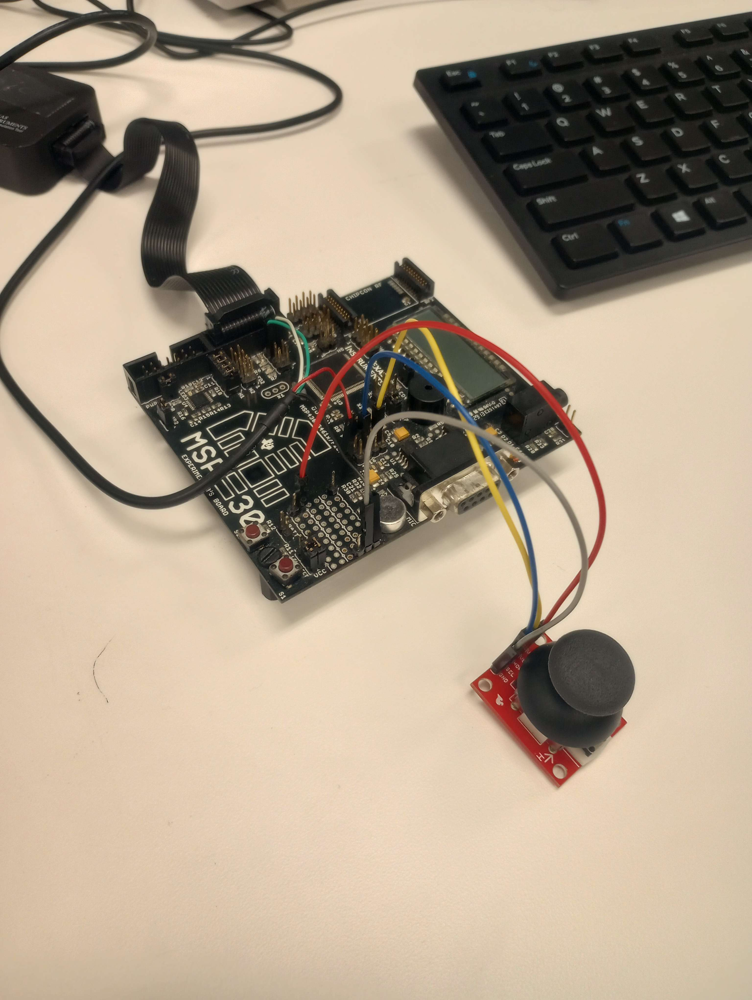
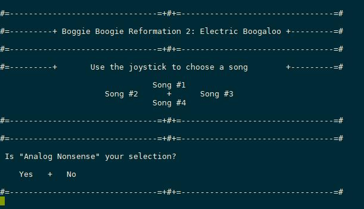

# Microcontroller Joystick Project 
- Programmed in embedded C, interfaced with on-board timers, system interrupts, analog-to-digital converter 
for an analog thumb-stick, UART serial connections, and interfacing with various LEDs & buzzer 

**Goal:** 
- develop timed-rhythm game for Embedded Systems Lab final project
  
**Concepts Used:** 
- UART Serial Communication
- Input Debouncing
- Interrupts
- Bitwise Byte Operations
- Voltage Input Mapping
- Timers
- Analog-to-Digital Signal Conversion
  
**Functionality:**
- Uses Analog thumbstick to:
  - Select 1-of-4 songs in terminal menu
  - move thumbsitck in reaction to song arrow movements according to chosen song:
    - If player makes it to end of song with 3 or less mistakes --> win scenario
    - If player makes 3 or more mistakes --> lose scenario
  - Play again terminal screen
- Buzzer emits different Hz soundwave depending on song arrow
- Green, Yellow, and Red LEDs emit respectively on the number of mistakes made

  
**Hardware:**
- TI MSP430-4618 Microcontroller
- USB UART Serial Commmunication Wire
- Thumbstick
- MobaXTerm USB Terminal Screen

## Hardare Setup & Terminal Output

